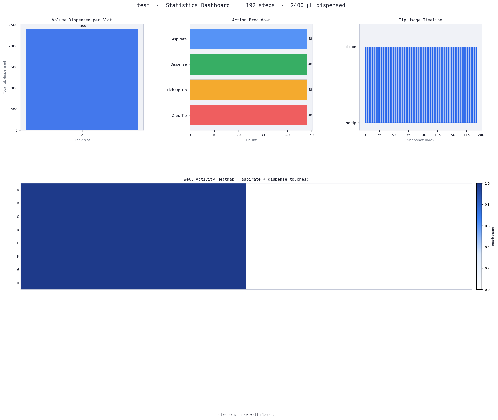
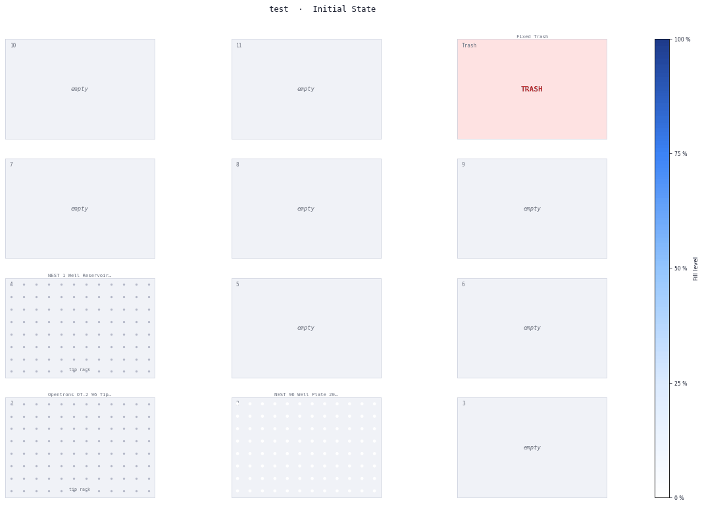

# LLM-Driven Optimization and Visualization of Opentrons OT-2 Protocols

**BIOE 234 Final Project — Spring 2026**

A conversational AI system that lets you describe a lab protocol in plain English and automatically generates an Opentrons OT-2 Python script, simulates it, identifies optimization opportunities via heuristic analysis, and produces rich visualizations — all through a single chat interface.

---

## Team

| Member | Role | Module |
|--------|------|--------|
| Taylor Elliott | Protocol Generation | `generate_protocol` |
| Adriann Brodeth | Simulation Engine | `simulate_protocol` |
| Alex Haynes | Heuristic Analysis | `analyze_protocol` |
| Christian Chung | Visualization | `visualize_deck_state` |
| Joshua Yap | MCP Server Integration | `run_full_pipeline` + tool wiring |

---

## What it does

**User types:** *"Set up a 1:2 serial dilution with 8 steps and 100 µL starting volume."*

The pipeline automatically:

1. **Generates** a complete OT-2 Python protocol script tailored to the task
2. **Simulates** it with `opentrons_simulate` (dry-run, no robot needed)
3. **Analyzes** the simulation log with 6 heuristic detectors for tip waste, volume overflow, empty aspirate, pipette range mismatches, batchable transfers, and tip rack exhaustion
4. **Visualizes** the results as four artefacts:
   - Multi-page **PDF report** (cover, deck snapshots, per-plate heatmaps, step log table)
   - Interactive **Plotly HTML dashboard** with animated plate heatmaps
   - **GIF animation** stepping through every deck state
   - **Statistics PNG** (volume per slot, action breakdown, tip timeline, well activity heatmap)

---

## Supported protocol types

| `task_type` | Description |
|-------------|-------------|
| `serial_dilution` | Multi-step fold dilution across 96-well plate columns |
| `pcr_setup` | Master mix + sample dispensing for PCR plates |
| `rt_normalization` | RNA concentration normalization before reverse transcription |

---

## Architecture

```
streamlit run app.py
        │
        ├── Gemini 2.5 Flash (function-calling)
        │         │
        │         └── run_ot2_pipeline (tool declaration in app.py)
        │                   │
        │                   └── modules/opentrons/_lib/
        │                             ├── generator.py
        │                             ├── simulation_engine.py
        │                             ├── analyzer.py
        │                             └── visualizer/
        │
        └── ~/Downloads/OT2_outputs/<run_id>/
                  ├── report.pdf
                  ├── dashboard.html
                  ├── deck_animation.gif
                  └── stats_dashboard.png
```

The MCP server (`server.py`) and terminal client (`client_gemini.py`) also exist for headless/CLI use. The Streamlit app (`app.py`) is the primary interface for end users.

Internal libraries live in `modules/opentrons/_lib/`:

```
_lib/
  generator.py
  simulation_engine.py
  analyzer.py
  recommendation.py
  heuristics/
  visualizer/
    log_parser.py
    state_tracker.py
    deck_visualizer.py
    plate_visualizer.py
    html_exporter.py
    report_generator.py
    stats_visualizer.py
```

---

## Setup

### Prerequisites

- Python 3.10 or newer ([python.org](https://python.org))
- A free Google Gemini API key — [aistudio.google.com/api-keys](https://aistudio.google.com/api-keys) (sign in with UC Berkeley Google account)

### Windows (recommended) — double-click setup

1. Clone or download this repo
2. Double-click **`setup.bat`** — creates both virtual environments and configures `.env` automatically
3. Open `.env` and paste your Gemini API key: `GEMINI_API_KEY="your_key_here"`
4. Double-click **`launch.bat`** to start the web app

### Manual setup (Mac/Linux or if setup.bat fails)

```bash
# Main venv
python -m venv .venv
source .venv/bin/activate        # Mac/Linux
pip install -r requirements.txt

# Opentrons venv (separate — avoids pydantic/anyio conflict with FastMCP)
python -m venv venv_ot
./venv_ot/bin/pip install opentrons
```

Create a `.env` file in the project root:

```
GEMINI_API_KEY="your_key_here"
OT_VENV_PYTHON="/full/path/to/venv_ot/bin/python"
```

Then run the app:
```bash
source .venv/bin/activate
streamlit run app.py --server.headless true
```

---

## Running

**Windows:** double-click `launch.bat`

**Mac/Linux / manual:**
```bash
source .venv/bin/activate
streamlit run app.py --server.headless true
```

Then open **http://localhost:8501** in your browser. Type a protocol description in the chat box and hit Enter.

> **Tip:** Each protocol run should be in its own session. If you run a second protocol and get unexpected or repeated output, click **🔄 New session** in the sidebar to clear the conversation history before submitting a new prompt.

---

## Example prompts

These prompts use the free-form generation path (no hard-coded templates). Each uses a single pipette and a focused task to produce reliable simulation output.

---

### 1. Plate-to-Plate Transfer

```
Using a P300 single-channel pipette, transfer 100 uL from each individual well
of a 96-well flat-bottom plate in slot 3 into the corresponding well of a
second 96-well flat-bottom plate in slot 2. Load a tip rack in slot 1. Pick up
a new tip before each transfer and drop it after. No other labware is needed.
```

---

### 2. Reagent Addition to Selected Wells

```
Add 50 uL of buffer from a reservoir in slot 4 into wells A1 through H6 of a
96-well flat-bottom plate in slot 2. Use a P300 single-channel pipette with
one tip for all dispenses.
```

---

### 3. Serial Dilution

```
Perform a 1:2 serial dilution across 8 wells in row A of a 96-well plate in
slot 2. Pre-fill wells A2 through A8 with 100 uL of diluent from a reservoir
in slot 3. Transfer 100 uL from A1 into A2, mix 5 times, then transfer 100 uL
from A2 into A3, and so on through A8. Use a P300 single-channel pipette and
change tips between each transfer step.
```

---

### 4. Column Pooling

```
Pool 25 uL from every well in column 1 of a 96-well plate in slot 2 into well
A1 of a 12-well reservoir in slot 5. Repeat for columns 2 through 6, pooling
each into wells A2 through A6 of the reservoir. Use a P300 single-channel
pipette with a fresh tip per well.
```

---

### 5. Sample Normalization

```
Normalize 8 samples from column 1 of a source plate in slot 3 to a final
volume of 100 uL in a destination plate in slot 2. Each sample has a known
concentration: A1=200 ng/uL, B1=150, C1=100, D1=80, E1=60, F1=50, G1=40,
H1=30. Target concentration is 25 ng/uL. Add water from a reservoir in slot 4
first, then add sample. Use a P300 single-channel pipette with fresh tips for
each well.
```

---

### 6. Compound Distribution

```
Distribute 75 uL of compound A from well A1 of a source plate in slot 3 into
wells A1, B1, C1, D1, E1, F1, G1, and H1 of a destination plate in slot 2.
Then distribute 75 uL of compound B from well A2 of the source plate into
wells A2 through H2 of the destination plate. Repeat for compounds C through
H (columns 3-8 of source plate to columns 3-8 of destination plate). Use a
P300 single-channel pipette with a fresh tip per compound.
```

---

### 7. Tip-Reuse Optimization Test

```
Transfer 50 uL from well A1 of a source plate in slot 3 into each of wells
A1, A2, A3, A4, A5, A6, A7, and A8 of a destination plate in slot 2. Use a
P300 single-channel pipette and pick up a new tip before every single transfer.
```

---

## Example outputs

The following outputs were generated from the **Reagent Addition to Selected Wells** prompt above.

### Statistics dashboard


### Deck animation


### PDF report
[Download report.pdf](examples/reagent_addition/report.pdf)

---

## Running tests

```powershell
pytest -vv -l
```

Tests cover:
- `seq_basics` example tools (reverse complement, translate)
- `generate_protocol` — script generation for all task types, error handling
- `analyze_protocol` — recommendation structure, empty log edge case

Simulation and visualization tests require the Opentrons venv and are best run manually.

---

## Output files

All outputs are written to `~/Downloads/OT2_outputs/<run_id>/` (auto-created, excluded from git):

| File | Description |
|------|-------------|
| `report.pdf` | Multi-page PDF: cover page, initial/final deck states, per-plate heatmaps before/after, full step log table |
| `dashboard.html` | Self-contained interactive HTML; animated 96-well plate heatmaps with play/pause slider |
| `deck_animation.gif` | Animated GIF cycling through deck snapshots at 2 fps |
| `stats_dashboard.png` | 4-panel figure: volume dispensed per slot, action type breakdown, tip usage timeline, well activity heatmap |

---

## Heuristic detectors

`analyze_protocol` runs 6 independent detectors on the simulation log:

| Detector | Issue flagged |
|----------|--------------|
| `tip_waste` | Tips discarded after a single use when reuse is safe |
| `volume_overflow` | Dispense would exceed well maximum volume |
| `empty_aspirate` | Aspirating from a well with insufficient volume |
| `pipette_range` | Transfer volume outside the pipette's accurate operating range |
| `batchable_transfers` | Repeated single-well transfers that could be combined |
| `tip_rack_exhaustion` | Protocol would use more tips than are loaded |

Each recommendation includes `issue`, `severity` (low/medium/high), `description`, and `suggestion`.

---

## Limitations and future work

| Area | Current limitation | What would fix it |
|------|--------------------|-------------------|
| **Protocol types** | Three hard-coded templates + free-form Gemini generation for custom protocols. Free-form can hallucinate invalid labware names or API calls. | Expand labware vocabulary; add a validation layer that checks generated scripts against the Opentrons labware library before simulating. |
| **Simulation only** | `opentrons_simulate` is a dry-run — it does not connect to a real OT-2 or check physical liquid levels. | Integrate with the Opentrons HTTP API for live robot execution and liquid-level sensing. |
| **Robot model** | OT-2 only (API level 2.15). The newer Opentrons Flex (OT-3) uses a different API and deck layout. | Add a robot-model selector and separate code-generation paths for Flex. |
| **Single pipette** | The template generator loads one pipette per protocol. Dual-pipette workflows (e.g. P20 + P300 simultaneously) are not supported in templates, only in free-form custom mode. | Extend the template parameter schema to support a second `pipette_right` instrument. |
| **Heuristic analysis** | The 6 detectors are rule-based and do not learn from protocol history or understand protocol intent. | Train a small ML model on real protocol logs to predict non-obvious waste patterns. |
| **Labware vocabulary** | The log parser and volume heuristics recognise ~15 common labware types. Unusual labware (custom plates, specialty reservoirs) may appear as unrecognised "Note" steps. | Maintain a full labware JSON catalogue and auto-update from the Opentrons labware repository. |
| **No multi-step / loop protocols** | Complex protocols with conditional branching, thermocycler loops, or heater-shaker steps are partially supported in free-form mode but not in templates. | Add template types for thermocycler PCR and heater-shaker mixing. |
| **LLM cost and latency** | Every custom protocol generation makes a Gemini API call. With a free-tier key this adds ~2–5 s and may hit rate limits. | Cache generated scripts by description hash; add a local LLM fallback (e.g. Ollama). |

---

## Framework notes

This project is built on the **BioE234 MCP Starter** framework. The framework auto-discovers tools by scanning `modules/<name>/tools/` for `.py` + `.json` file pairs and registers them as MCP tools without any boilerplate.

Key conventions:
- Each tool is a **Function Object** class with `initiate()` (one-time setup) and `run()` (per-call logic)
- A module-level alias `tool_name = _instance.run` exposes the function for direct import and testing
- A companion `.json` file declares the tool's schema, description, and parameters
- `SKILL.md` injects domain knowledge into Gemini's system prompt at startup

See `modules/seq_basics/` for a minimal worked example of the pattern.

---

## Understanding "Note" steps

If your PDF report or statistics chart contains steps labelled **"Note"**, it means the simulation log contained lines that the visualizer's parser could not classify as a known pipetting action (aspirate, dispense, pick-up tip, etc.).

Common causes:
- The generated script uses a non-standard labware name not in the parser's vocabulary
- The protocol includes custom or module-specific commands (e.g. thermocycler profiles) that produce unusual log lines
- Opentrons printed a calibration or runtime warning that slipped through the skip-list

**How to fix:** These steps are cosmetic — they do not affect the simulation or heuristic analysis. If they bother you, you can re-run with a simpler prompt that avoids uncommon labware names, or open `modules/opentrons/_lib/visualizer/log_parser.py` and add the offending line pattern to `RE_SKIP_LINE`.

---

## Troubleshooting

**`simulate_protocol` returns an error about opentrons not found**  
Check that `OT_VENV_PYTHON` in `.env` points to the correct Python executable inside `venv_ot`.

**Gemini 503 / quota error**  
The free Gemini tier has rate limits. Wait 30 seconds — the client retries automatically.

**`ModuleNotFoundError` on startup**  
Make sure `.venv` is activated before running `streamlit run app.py`.

**GIF export fails**  
Install Pillow: `pip install Pillow`. For MP4 export also install `imageio[ffmpeg]`.

**HTML dashboard shows "no tracked plates"**  
The log parser looks for standard Opentrons 96-well plate labware names. Verify the generated script uses a recognized labware identifier (see `modules/opentrons/SKILL.md`).

**Second pipeline run gives an error in the same browser session**  
This should be fixed in the current version (run IDs now use millisecond timestamps). If it still happens, click **🔄 New session** in the sidebar or refresh the page.

---
